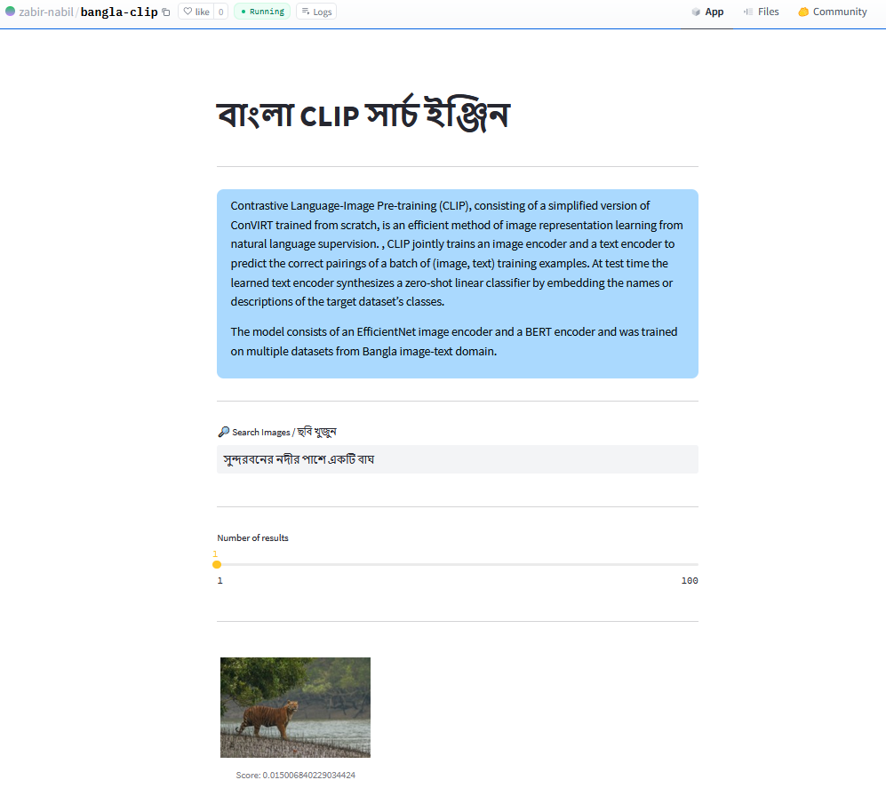
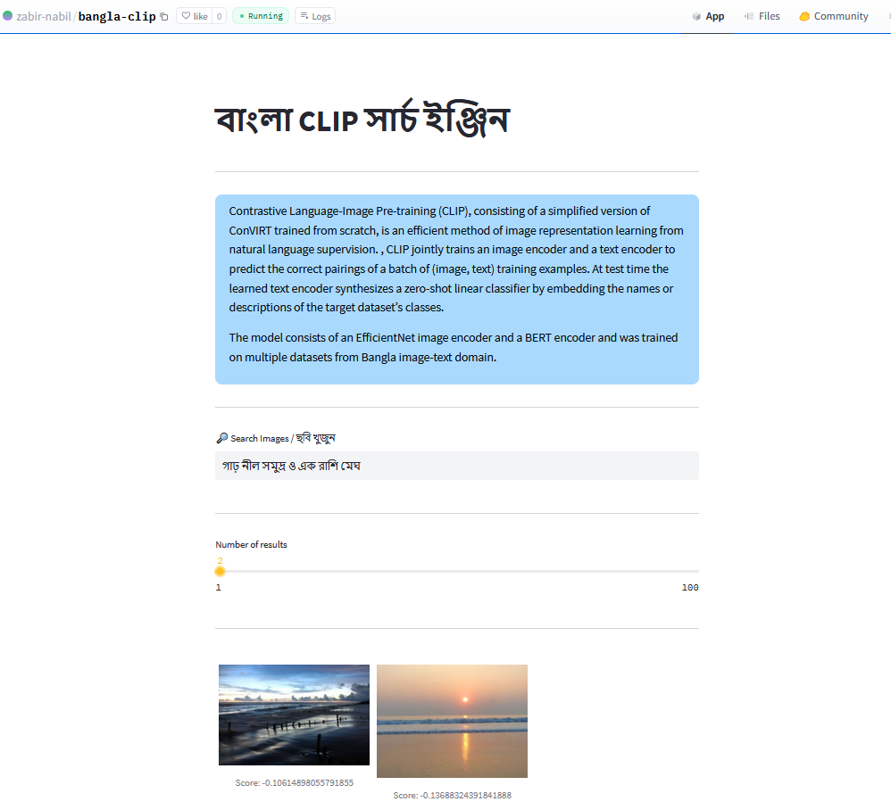

<p align="center">
  <a href="#"></a>
</p>
<p align="center">
    <em>A dead-simple image search and image-text matching system for Bangla using CLIP (Contrastive Language–Image Pre-training)</em>
</p>


---
### bangla-image-search
The model consists of an EfficientNet / ResNet image encoder and a BERT text encoder and was trained on multiple datasets from Bangla image-text domain.

```console
streamlit run app.py
```

#### Installation

* `python >= 3.9`
* `pip install -requirements.txt`
* Download the model weights and place inside the `models` folder.


---

### Demo

<p align="center">
  <a href="#"></a>
</p>
<p align="center">
    <em>Live Demo: </em> [HuggingFace Space](https://huggingface.co/spaces/zabir-nabil/bangla-clip)
</p>


